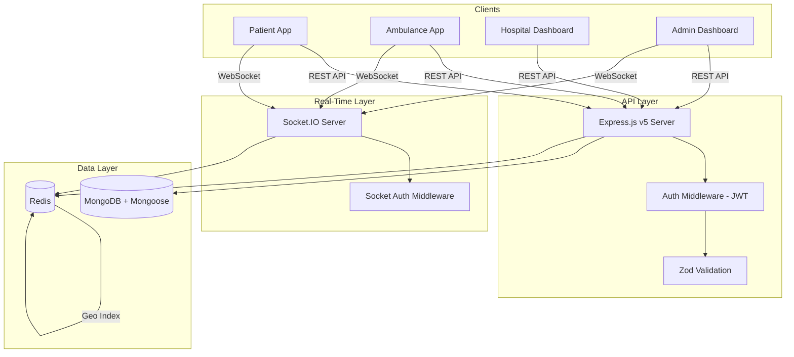

# MedSwift 🚑

**Real-Time Emergency Dispatch & Medical Coordination System**

MedSwift is a high-performance backend infrastructure designed to solve the critical "last-mile" problem in emergency medical services. In a medical emergency, every second saved translates directly to lives preserved. MedSwift replaces manual, fragmented coordination with an automated, location-aware system that connects **patients**, **ambulances**, and **hospitals** in real-time.

> [!NOTE]
> This repository contains the **backend API server** and a companion **frontend dashboard**. The backend is the core of the system.

---

## 🛑 The Problem: Fragmentation in the "Golden Hour"

In most developing regions, calling for an ambulance triggers a chaotic chain of manual phone calls:

1. **Patient calls a helpline** → An operator manually searches for an available ambulance
2. **Operator calls ambulance drivers** → one by one, hoping someone picks up and is nearby
3. **Ambulance arrives at patient** → Driver calls hospitals to find one with available beds
4. **Hospital confirmed** → Driver navigates there, often without optimal routing

Each step introduces **minutes of delay**. In cardiac arrest, brain damage begins after **4–6 minutes**. MedSwift automates this entire chain into a **sub-second automated dispatch pipeline**.

---

## ⚡ How MedSwift Works

```
Patient Request → Auto-Dispatch (Redis Geo) → Nearest Ambulance Assigned
                                              → Real-time GPS Tracking (Socket.IO)
                                              → Hospital Found (Geo + Inventory)
                                              → Trip Lifecycle Managed
```

1. **Patient** creates a trip → system searches for the nearest available ambulance using **Redis geospatial indexes** with automatic radius failover (5km → 10km → 17km → 30km)
2. **Ambulance** is auto-assigned → driver receives real-time notification via **Socket.IO**
3. **Live GPS tracking** → patient and ambulance share locations in real-time through trip rooms
4. **Hospital matching** → system finds nearby hospitals filtered by bed availability and blood stock
5. **Trip lifecycle** → status progresses through a defined state machine with real-time updates to all participants

---

## 🏗️ System Architecture



> For detailed architecture docs, see [architecture.md](./src/docs/architecture.md)

---

## 🛠️ Tech Stack

| Layer | Technology | Purpose |
|-------|-----------|---------|
| **Runtime** | Node.js 22 | JavaScript runtime |
| **Framework** | Express.js v5 | HTTP server & routing |
| **Language** | TypeScript | Type safety |
| **Database** | MongoDB + Mongoose | Primary data store with geospatial indexes |
| **Cache / Geo** | Redis | Geospatial ambulance/hospital dispatch, socket mapping, location cache |
| **Real-Time** | Socket.IO | WebSocket communication for live tracking |
| **Auth** | JWT (jsonwebtoken) | Access & refresh token authentication |
| **Hashing** | argon2 | Password hashing |
| **Validation** | Zod | Request body/query/params schema validation |
| **Rate Limiting** | express-rate-limit + Redis store | API abuse protection |
| **Security** | Helmet | HTTP security headers |
| **API Docs** | Swagger (swagger-ui-express) | Interactive API documentation |
| **Queue** | BullMQ | Background job processing |
| **Container** | Docker + Docker Compose | Containerized deployment |
| **Tunnel** | Cloudflare Tunnel | Public URL for development |

---

## 📁 Project Structure

```
Medswift/
├── src/
│   ├── index.ts                          # Server bootstrap & startup
│   ├── app.ts                            # Express app config, middleware, routes
│   ├── config/
│   │   ├── Dbconnecton.ts                # MongoDB connection
│   │   ├── env.ts                        # Environment variable exports
│   │   ├── redis.ts                      # Redis client setup
│   │   └── queue.config.ts               # BullMQ queue connection
│   ├── modules/
│   │   ├── user/                         # Patient/User module
│   │   │   ├── model/user.model.ts
│   │   │   ├── controller/user.controller.ts
│   │   │   ├── routes/user.routes.ts
│   │   │   └── user.dto/user.dto.ts
│   │   ├── ambulance/                    # Ambulance/Driver module
│   │   │   ├── model/ambulance.model.ts
│   │   │   ├── controllers/ambulance.controller.ts
│   │   │   ├── routes/ambulance.routes.ts
│   │   │   ├── services/ambulance.service.ts
│   │   │   └── ambulance.dto/ambulance.dto.ts
│   │   ├── hospital/                     # Hospital module
│   │   │   ├── model/hospital.model.ts
│   │   │   ├── controllers/hospital.controller.ts
│   │   │   ├── routes/hospital.routes.ts
│   │   │   ├── services/hospital.service.ts
│   │   │   └── hospital.dto/hospital.dto.ts
│   │   ├── trip/                         # Trip lifecycle module
│   │   │   ├── model/trip.model.ts
│   │   │   ├── controllers/trip.controller.ts
│   │   │   ├── routes/trip.routes.ts
│   │   │   ├── services/trip.service.ts
│   │   │   └── trip.dto/trip.dto.ts
│   │   └── admin/                        # Admin module
│   │       ├── models/admin.model.ts
│   │       ├── controllers/admin.controller.ts
│   │       ├── routes/admin.routes.ts
│   │       └── admin.dto/admin.dto.ts
│   ├── shared/
│   │   ├── infra/
│   │   │   ├── sockets/
│   │   │   │   ├── socket.config.ts      # Socket.IO initialization
│   │   │   │   ├── socket.middleware/     # JWT auth for WebSocket
│   │   │   │   ├── handlers/             # Connection handler
│   │   │   │   └── events/               # Trip & location event handlers
│   │   │   ├── Queues/                   # BullMQ job queues
│   │   │   └── notifications/            # Notification infrastructure
│   │   ├── middlewares/
│   │   │   ├── auth.middleware.ts         # JWT verification (per-role)
│   │   │   └── validate.middleware.ts     # Zod schema validation
│   │   └── utils/
│   │       ├── ApiError.ts               # Standardized error class
│   │       ├── ApiResponce.ts            # Standardized response class
│   │       ├── AsyncHandler.ts           # Async route wrapper
│   │       └── auth.util.ts              # Password hashing & JWT generation
│   └── docs/
│       ├── sockethandling.md             # Socket.IO event reference
│       ├── api-reference.md              # REST API reference
│       └── architecture.md               # System architecture docs
├── frontend/                             # Frontend dashboard (Vite + React)
├── Dockerfile                            # Backend container
├── docker-compose.yml                    # Full stack orchestration
├── medswift_swagger.yml                  # OpenAPI/Swagger spec
├── example.env                           # Environment template
├── tsconfig.json                         # TypeScript config
└── package.json                          # Dependencies & scripts
```

---

## 🚀 Getting Started

### Prerequisites

- **Node.js** ≥ 22
- **pnpm** (corepack enabled) — `corepack enable`
- **MongoDB** (local or Atlas)
- **Redis** (local or cloud like Upstash/Redis Cloud)

### 1. Clone & Install

```bash
git clone https://github.com/your-org/medswift.git
cd medswift
pnpm install
```

### 2. Configure Environment

```bash
cp example.env .env
```

Edit `.env` with your values:

| Variable | Description | Example |
|----------|-------------|---------|
| `PORT` | Server port | `5000` |
| `MONGO_URI` | MongoDB connection string | `mongodb://localhost:27017/medswift` |
| `ACCESS_TOKEN_SECRET` | JWT signing secret (access) | `your_secret_key` |
| `REFRESH_TOKEN_SECRET` | JWT signing secret (refresh) | `your_secret_key` |
| `NODE_ENV` | Environment | `development` / `production` |
| `REDIS_URL` | Redis connection URL | `redis://localhost:6379` |
| `ADMIN_CREATION_SECRET` | Secret key to authorize admin registration | `your_admin_secret` |
| `BASE_URL` | Backend base URL | `http://localhost:5000` |
| `FRONTEND_URL` | Frontend URL (for CORS) | `http://localhost:5173` |

### 3. Run in Development

```bash
pnpm dev
```

Server starts at `http://localhost:5000` with hot-reload via `tsx watch`.

### 4. Build & Run Production

```bash
pnpm build      # Compiles TypeScript → dist/
pnpm start      # Runs compiled JS
```

---

## 🐳 Docker Deployment

The project includes a full Docker Compose stack with backend, frontend, and Cloudflare Tunnel:

```bash
docker compose up --build
```

| Service | Port | Description |
|---------|------|-------------|
| `backend` | 5000 | Node.js API server |
| `frontend` | 80 | Frontend dashboard (Nginx) |
| `tunnel` | — | Cloudflare Tunnel (auto public URL) |

> [!IMPORTANT]
> Set `MONGO_URI` and `REDIS_URL` to externally accessible URLs in `.env` when using Docker (containers can't reach `localhost` services on the host).

---

## 🔌 API Routes Overview

All routes are prefixed with `/api/v2`. Interactive Swagger docs available at `/api-docs`.

### User (Patient)
| Method | Path | Auth | Description |
|--------|------|------|-------------|
| POST | `/user/register` | Public | Register new user (name, email, phone, bloodGroup, location) |
| POST | `/user/login` | Public | Login with email or phone + password |
| POST | `/user/logout` | User | Logout & clear tokens |
| GET | `/user/me` | User | Get user profile |

### Ambulance
| Method | Path | Auth | Description |
|--------|------|------|-------------|
| POST | `/ambulance/register` | Public | Register ambulance |
| POST | `/ambulance/login` | Public | Login with phone + password |
| POST | `/ambulance/logout` | Ambulance | Logout |
| GET | `/ambulance/me` | Ambulance | Get profile |
| PATCH | `/ambulance/status` | Ambulance | Update status (ready/on-trip/offline) |
| PATCH | `/ambulance/location` | Ambulance | Update GPS location |
| GET | `/ambulance/nearby` | Public | Find nearby ambulances |
| GET | `/ambulance/stats` | Public | Active ambulance statistics |

### Hospital
| Method | Path | Auth | Description |
|--------|------|------|-------------|
| POST | `/hospital/register` | Public | Register hospital |
| POST | `/hospital/login` | Public | Login with email + password |
| POST | `/hospital/logout` | Hospital | Logout |
| GET | `/hospital/me` | Hospital | Get profile |
| PATCH | `/hospital/inventory` | Hospital | Update beds & blood stock |
| PATCH | `/hospital/location` | Hospital | Update GPS location |
| GET | `/hospital/nearby` | Public | Find nearby hospitals (with filters) |

### Trip
| Method | Path | Auth | Description |
|--------|------|------|-------------|
| POST | `/trip/request` | User | Request an ambulance (auto-dispatch) |
| GET | `/trip/active` | User | Get user's active trip |
| GET | `/trip/history` | User | Get user's trip history |
| POST | `/trip/:tripId/cancel` | User/Ambulance | Cancel a trip |
| GET | `/trip/ambulance/active` | Ambulance | Get ambulance's active trip |
| POST | `/trip/:tripId/accept` | Ambulance | Accept a SEARCHING trip |
| PATCH | `/trip/:tripId/status` | Ambulance | Update trip status |
| GET | `/trip/:tripId` | User/Ambulance/Admin | Get trip details by ID |
| GET | `/trip/admin/all` | Admin | List all trips (paginated) |

### Admin
| Method | Path | Auth | Description |
|--------|------|------|-------------|
| POST | `/admin/register` | Public* | Register admin (requires secret key) |
| POST | `/admin/login` | Public | Login |
| POST | `/admin/logout` | Admin | Logout |
| GET | `/admin/me` | Admin | Get profile |
| GET | `/admin/debug/redis` | Admin | Debug Redis state |

> For complete request/response schemas, see [api-reference.md](./src/docs/api-reference.md)

---

## 🔄 Real-Time (Socket.IO)

MedSwift uses Socket.IO for real-time communication. Key capabilities:

- **JWT authentication** on WebSocket handshake
- **Trip rooms** — automatic room-based event routing
- **Live GPS tracking** — ambulance & patient location streaming
- **Emergency SOS** — instant broadcast to trip room + admin room
- **Connection monitoring** — disconnect notifications to trip participants

> For the complete Socket.IO event reference, see [sockethandling.md](./src/docs/sockethandling.md)

---

## 📖 Documentation Index

| Document | Description |
|----------|-------------|
| [README.md](./Readme.md) | Project overview (this file) |
| [sockethandling.md](./src/docs/sockethandling.md) | Socket.IO events reference |
| [api-reference.md](./src/docs/api-reference.md) | Complete REST API reference |
| [architecture.md](./src/docs/architecture.md) | System architecture & design |
| [medswift_swagger.yml](./medswift_swagger.yml) | OpenAPI/Swagger specification |

---

## 📄 License

ISC
