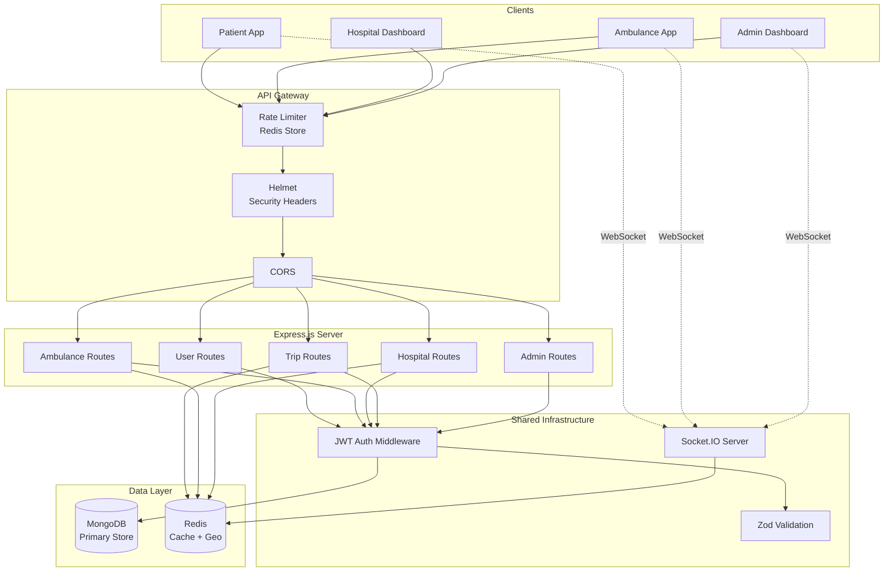
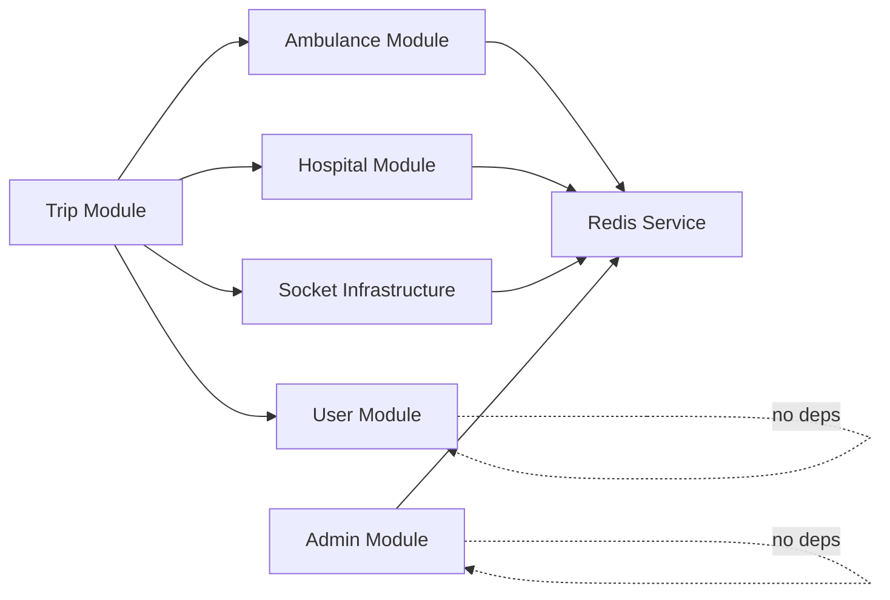
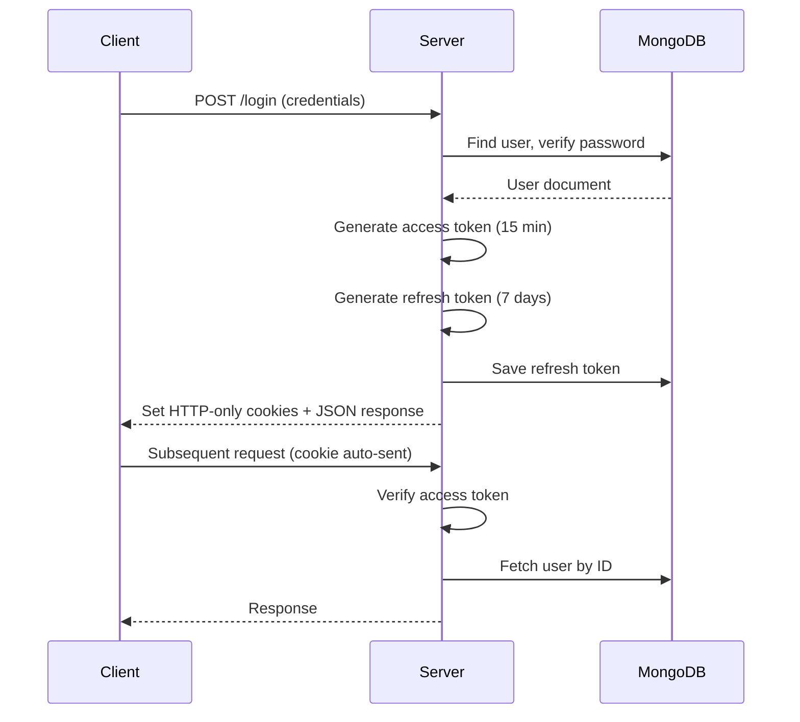
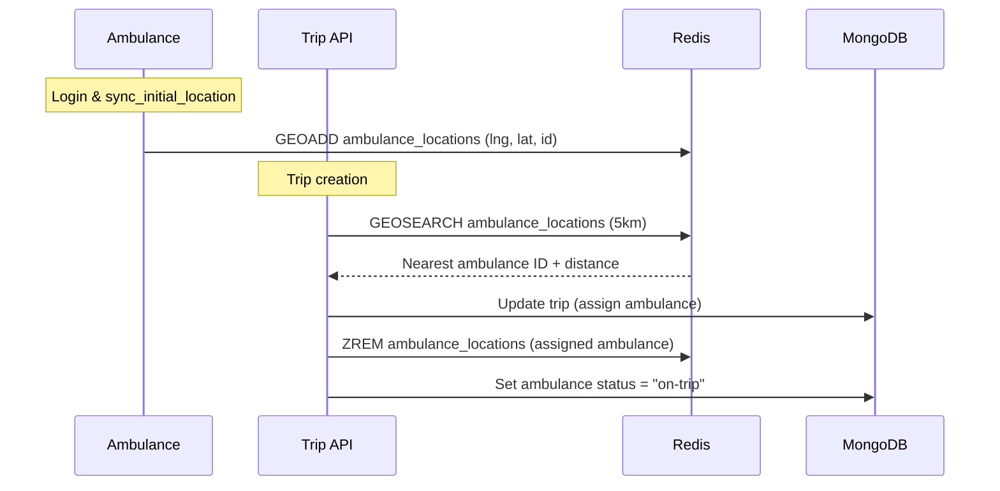
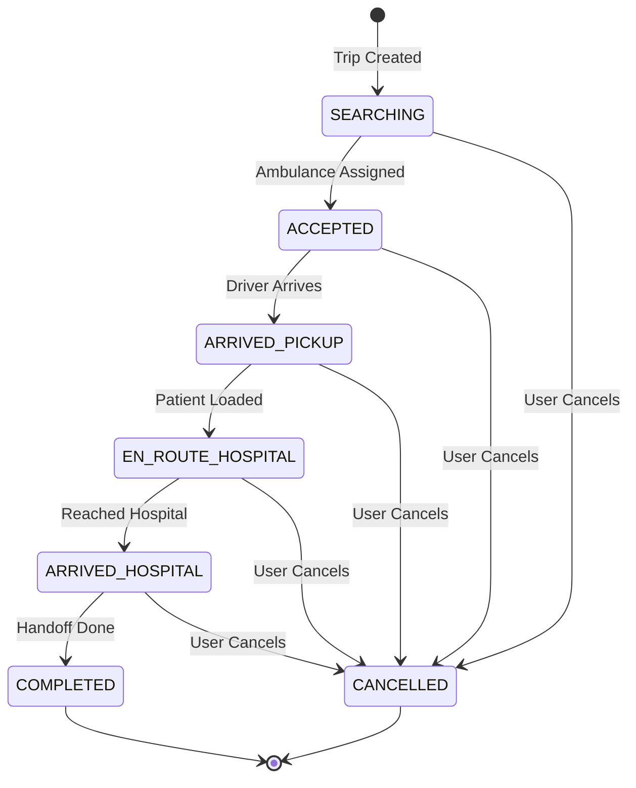
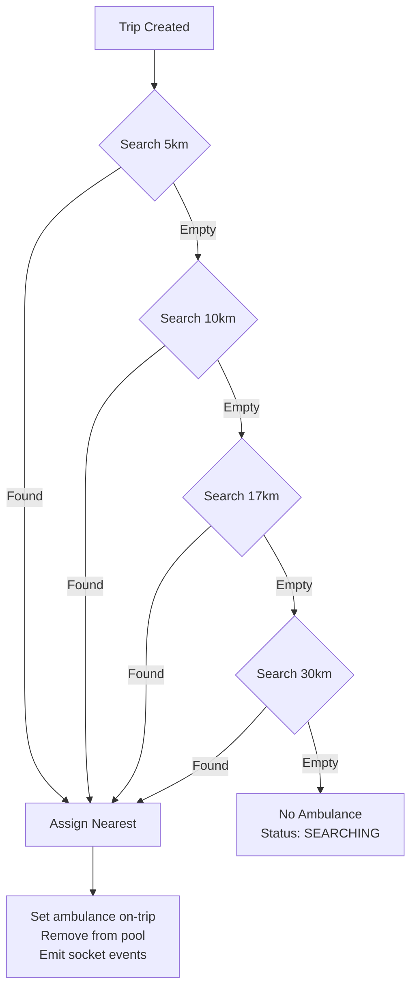
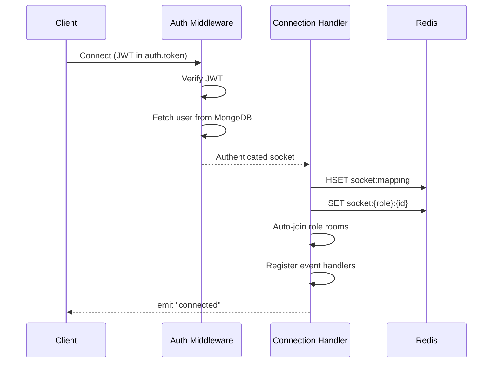
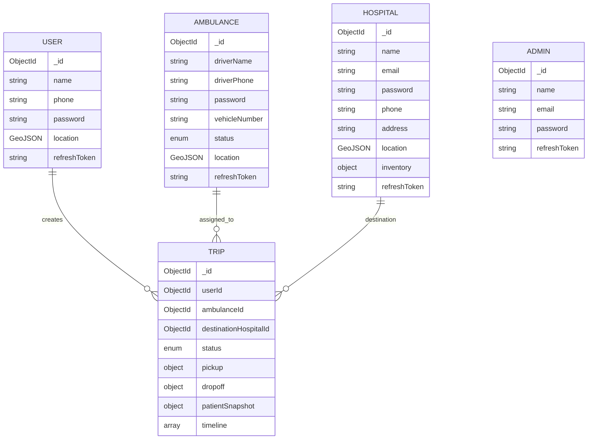
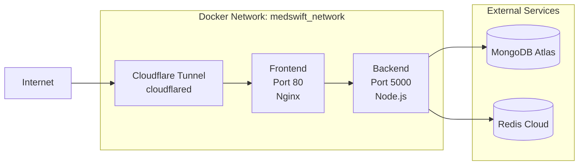

# MedSwift System Architecture

**Last Updated:** February 13, 2026  
**Version:** 2.0

---

## Table of Contents

1. [High-Level Architecture](#high-level-architecture)
2. [Module Structure](#module-structure)
3. [Authentication System](#authentication-system)
4. [Redis Infrastructure](#redis-infrastructure)
5. [Trip Lifecycle](#trip-lifecycle)
6. [Auto-Dispatch Algorithm](#auto-dispatch-algorithm)
7. [Socket.IO Architecture](#socketio-architecture)
8. [Data Models](#data-models)
9. [Middleware Pipeline](#middleware-pipeline)
10. [Deployment Architecture](#deployment-architecture)

---

## High-Level Architecture



MedSwift is a **monolithic TypeScript backend** built with Express.js v5 and Socket.IO. It uses MongoDB as the primary data store and Redis for real-time geospatial operations, socket session management, and location caching.

---

## Module Structure

The codebase follows a **modular monolith** pattern with a layered architecture per module:

```
src/modules/{module}/
├── model/          → Mongoose schema + instance methods
├── controllers/    → Request handlers (thin, delegates to services)
├── services/       → Business logic, Redis operations
├── routes/         → Express router + middleware chain
└── {module}.dto/   → Zod schemas for validation + TypeScript types
```

### Module Dependency Map



The **Trip module** is the central orchestrator — it depends on Ambulance (dispatch), User (patient), Hospital (destination), and Socket.IO (real-time events).

---

## Authentication System

### JWT Token Architecture



### Token Generation

| Token | TTL | Secret | Payload |
|-------|-----|--------|---------|
| Access Token | 15 minutes | `ACCESS_TOKEN_SECRET` | `{ id, role }` |
| Refresh Token | 7 days | `REFRESH_TOKEN_SECRET` | `{ id, role }` |

**Roles:** `user`, `ambulance`, `hospital`, `admin`

### Password Hashing

Uses **argon2** (via `auth.util.ts`):
- `hashPassword()` → argon2 hash
- `verifyPassword()` → argon2 verify

### Cookie Configuration

```typescript
{
  httpOnly: true,                    // Not accessible via JS
  secure: NODE_ENV === "production", // HTTPS only in prod
  sameSite: "strict"                 // CSRF protection
}
```

---

## Redis Infrastructure

Redis serves three critical roles:

### 1. Geospatial Indexes

Ambulance and hospital locations are stored as Redis geo sets for O(log N) proximity searches.

| Key | Type | Purpose |
|-----|------|---------|
| `ambulance_locations` | GEO SET | Available ambulances for dispatch |
| `hospital_locations` | GEO SET | Registered hospitals for proximity search |

**Operations:**
- `GEOADD` — Add/update member location
- `GEOSEARCH` — Find members within radius (with distance + coordinates)
- `ZREM` — Remove member (logout/offline)
- `ZCARD` — Count active members

### 2. Socket Session Management

| Key Pattern | Type | TTL | Purpose |
|-------------|------|-----|---------|
| `socket:mapping` | HASH | — | `socketId → { userId, userRole, connectedAt }` |
| `socket:{role}:{userId}` | STRING | 1 hour | Reverse lookup: userId → socketId |
| `trip_participants:{tripId}` | SET | — | Set of socket IDs in a trip room |

### 3. Location Cache

| Key Pattern | Type | TTL | Purpose |
|-------------|------|-----|---------|
| `location:{role}:{tripId}` | STRING (JSON) | 5 min | Latest location data during active trip |

### Data Flow: Redis in Auto-Dispatch



---

## Trip Lifecycle

### State Machine



### Status & Transitions

| Status | Set By | Next Allowed | Description |
|--------|--------|-------------|-------------|
| `SEARCHING` | System | `ACCEPTED`, `CANCELLED` | Trip created, searching for ambulance |
| `ACCEPTED` | System | `ARRIVED_PICKUP`, `CANCELLED` | Ambulance assigned, en route to patient |
| `ARRIVED_PICKUP` | Ambulance | `EN_ROUTE_HOSPITAL`, `CANCELLED` | Ambulance at pickup location |
| `EN_ROUTE_HOSPITAL` | Ambulance | `ARRIVED_HOSPITAL`, `CANCELLED` | Patient aboard, heading to hospital |
| `ARRIVED_HOSPITAL` | Ambulance | `COMPLETED`, `CANCELLED` | Arrived at hospital |
| `COMPLETED` | Ambulance | — | Trip finished, ambulance released |
| `CANCELLED` | User | — | Trip aborted at any stage |

### Events Emitted Per Transition

| Transition | Socket Event | Target |
|-----------|-------------|--------|
| → `ACCEPTED` (auto) | `ambulance_assigned` | `user:{userId}` room |
| → `ACCEPTED` (auto) | `new_trip_assigned` | `ambulance:{ambulanceId}` room |
| → `ACCEPTED` (auto) | `trip_auto_assigned` | `admin-room` |
| `SEARCHING` (no ambulance) | `new_trip_request` | `ambulance-room` |
| Any status change | `trip_status_updated` | `trip:{tripId}` room |
| → `CANCELLED` | `trip_cancelled` | `trip:{tripId}` room |
| → `COMPLETED` | Ambulance status → `"ready"` | Redis geo index |

---

## Auto-Dispatch Algorithm

The dispatch system finds the nearest available ambulance using Redis geospatial queries with automatic radius failover.

### Algorithm



### Search Parameters

- **Radii:** 5km → 10km → 17km → 30km
- **Sort:** `ASC` (nearest first)
- **Pool:** Only ambulances with status `"ready"` in `ambulance_locations` geo set
- **Atomicity:** On assignment, ambulance is immediately removed from the geo set to prevent double-dispatch

### Race Condition Prevention

The system handles concurrent requests by:
1. Using MongoDB's `findOneAndUpdate` with `status: "ready"` filter
2. Immediately removing the ambulance from Redis geo index after assignment
3. If the MongoDB update returns `null` (ambulance already taken), the system moves to the next candidate

---

## Socket.IO Architecture

### Connection Flow



### Room Architecture

| Room | Members | Events Received |
|------|---------|----------------|
| `admin-room` | All connected admins | `new_trip_request`, `emergency_sos` |
| `ambulance-room` | All connected ambulances | Broadcast notifications |
| `ambulance:{id}` | Specific ambulance | `ambulance_assigned` |
| `user:{id}` | Specific user | Direct messages |
| `trip:{tripId}` | Trip participants | `location_updated`, `trip_status_updated`, `participant_joined/left` |

### Server-Side Emitter Functions

```typescript
// From socket.config.ts
emitToTrip(tripId, event, data)   // → trip:{tripId} room
emitToAdmins(event, data)         // → admin-room
```

> Full event reference: [sockethandling.md](./sockethandling.md)

---

## Data Models

### Entity Relationship



### Geospatial Indexes

All location fields use **GeoJSON Point** format with **2dsphere** indexes:

```typescript
location: {
  type: "Point",                    // Always "Point"
  coordinates: [longitude, latitude] // [lng, lat] — GeoJSON order
}
```

> [!IMPORTANT]
> GeoJSON uses `[longitude, latitude]` order, NOT `[latitude, longitude]`. This is a common source of bugs.

---

## Middleware Pipeline

### HTTP Request Pipeline

```
Request → Rate Limiter → Helmet → CORS → Cookie Parser → JSON Parser
       → Route Matching → Auth Middleware → Zod Validation → Controller
       → Error Handler
```

### Rate Limiting

```typescript
{
  windowMs: 15 * 60 * 1000,  // 15 minutes
  max: 100,                    // 100 requests per window
  store: RedisStore            // Distributed via Redis
}
```

### Validation Middleware

Uses the `validate()` middleware with Zod schemas:

```typescript
router.post(
  "/register",
  validate(z.object({ body: createUserSchema })),
  registerUser
);
```

The middleware validates `req.body`, `req.query`, and `req.params` against the schema. On failure, returns a `400` error with field-level error messages.

---

## Deployment Architecture

### Docker Compose Stack



| Container | Image | Port | Purpose |
|-----------|-------|------|---------|
| `medswift_backend` | Custom (Dockerfile) | 5000 | API + Socket.IO server |
| `medswift_frontend` | Custom (frontend/Dockerfile) | 80 | React dashboard via Nginx |
| `medswift_tunnel` | `cloudflare/cloudflared` | — | Public URL tunneling |

### Build Process

```
TypeScript → tsc → dist/index.js → node dist/index.js
```

The `Dockerfile` uses `pnpm` with frozen lockfile for reproducible builds.
