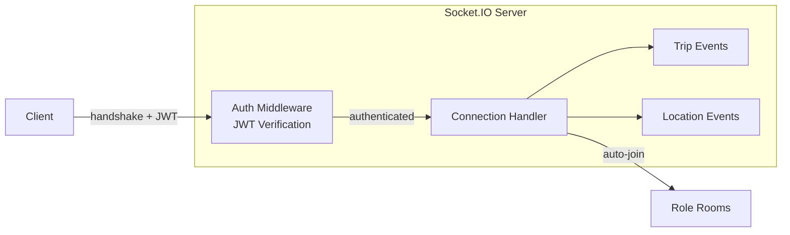

# MedSwift Socket.IO Documentation

**Version:** 2.0  
**Last Updated:** February 13, 2026  
**Source of truth:** `src/shared/infra/sockets/`

---

## Table of Contents

1. [Overview](#overview)
2. [Connection Setup](#connection-setup)
3. [Authentication](#authentication)
4. [Room Architecture](#room-architecture)
5. [Events Reference](#events-reference)
   - [Client → Server Events](#client--server-events)
   - [Server → Client Events](#server--client-events)
6. [Data Types](#data-types)
7. [Error Handling](#error-handling)
8. [Integration Examples](#integration-examples)

---

## Overview

MedSwift uses **Socket.IO** for real-time communication between patients, ambulances, and the admin dashboard. The socket layer handles:

- **Trip room management** — joining/leaving trip-specific rooms for scoped event delivery
- **Live GPS tracking** — streaming ambulance and patient locations during active trips
- **Emergency SOS** — instant broadcast to trip participants and admin
- **Connection monitoring** — automatic cleanup and participant disconnect notifications

### Architecture



**Source files:**

| File | Purpose |
|------|---------|
| [`socket.config.ts`](file:///home/raj/Desktop/Upgrades/Medswift/src/shared/infra/sockets/socket.config.ts) | Socket.IO server initialization, CORS, helper emitters |
| [`socket.middleware.ts`](file:///home/raj/Desktop/Upgrades/Medswift/src/shared/infra/sockets/socket.middleware/socket.middleware.ts) | JWT authentication middleware |
| [`connection.handler.ts`](file:///home/raj/Desktop/Upgrades/Medswift/src/shared/infra/sockets/handlers/connection.handler.ts) | Connection setup, Redis mapping, room joins, disconnect cleanup |
| [`trip.events.ts`](file:///home/raj/Desktop/Upgrades/Medswift/src/shared/infra/sockets/events/trip.events.ts) | Trip room join/leave/participants events |
| [`location.events.ts`](file:///home/raj/Desktop/Upgrades/Medswift/src/shared/infra/sockets/events/location.events.ts) | Location sync, updates, queries, and SOS |

---

## Connection Setup

### Server Configuration

```typescript
// From socket.config.ts
const io = new SocketServer(httpServer, {
  cors: {
    origin: [FRONTEND_URL, "http://localhost:5173/"],
    credentials: true,
    methods: ["GET", "POST"]
  },
  pingTimeout: 60000,     // 60s — time before connection considered lost
  pingInterval: 25000,    // 25s — ping frequency
  upgradeTimeout: 30000,  // 30s — WebSocket upgrade timeout
  maxHttpBufferSize: 1e8, // 100 MB max message size
  transports: ["websocket", "polling"],
  allowEIO3: true,        // Support Engine.IO v3 clients
});
```

### Client Connection

```javascript
import { io } from "socket.io-client";

const socket = io("http://localhost:5000", {
  auth: {
    token: "<your-jwt-access-token>"
  },
  transports: ["websocket", "polling"],
});

socket.on("connect", () => {
  console.log("Connected:", socket.id);
});
```

> [!IMPORTANT]
> The token must be a valid **access token** (JWT) obtained from any login endpoint (`/api/v2/user/login`, `/api/v2/ambulance/login`, or `/api/v2/admin/login`). The token's `role` field determines which rooms you auto-join.

---

## Authentication

The socket middleware (`socket.middleware.ts`) runs on every connection attempt:

1. **Extract token** from `socket.handshake.auth.token` or `socket.handshake.query.token`
2. **Verify JWT** using `ACCESS_TOKEN_SECRET` — reject with `"Authentication error: Invalid token"` if invalid
3. **Fetch user document** from MongoDB based on `decoded.role`:
   - `"user"` → `User.findById()`
   - `"ambulance"` → `Ambulance.findById()`
   - `"admin"` → `Admin.findById()`
4. **Attach to socket** — sets `socket.userId`, `socket.userRole`, and `socket.userData`

### Supported Roles

| Role | Model | Login Endpoint |
|------|-------|----------------|
| `user` | User | `POST /api/v2/user/login` |
| `ambulance` | Ambulance | `POST /api/v2/ambulance/login` |
| `admin` | Admin | `POST /api/v2/admin/login` |

> [!NOTE]
> Hospitals do **not** connect via Socket.IO. Hospital data is accessed through REST APIs only.

### Authentication Errors

| Error | Cause |
|-------|-------|
| `"Authentication error: No token provided"` | Missing token in handshake |
| `"Authentication error: Invalid token"` | Expired or malformed JWT |
| `"Authentication error: Invalid role"` | Token role not recognized |
| `"Authentication error: User not found"` | Token valid but user deleted |

---

## Room Architecture

On successful connection, clients are automatically joined to rooms based on their role:

```mermaid
graph TD
    CONN[Connection] --> CHECK{Role?}
    CHECK -->|admin| AR[admin-room]
    CHECK -->|ambulance| ABR[ambulance-room<br>+ ambulance:{id}]
    CHECK -->|user| UR[user:{id}]
    
    JOIN[join_trip event] --> TR[trip:{tripId}]
```

| Room | Who Joins | Purpose | Auto-Joined? |
|------|-----------|---------|--------------|
| `admin-room` | All admins | Receive system-wide alerts (SOS, new trips) | ✅ Yes |
| `ambulance-room` | All ambulances | Broadcast notifications to all ambulances | ✅ Yes |
| `ambulance:{id}` | Specific ambulance | Direct messages to one ambulance | ✅ Yes |
| `user:{id}` | Specific user | Direct messages to one user | ✅ Yes |
| `trip:{tripId}` | Trip participants | Scoped trip events (location, status) | ❌ Manual via `join_trip` |

### Redis Socket Mapping

On connection, two Redis entries are created:

```
HSET socket:mapping {socketId} → { userId, userRole, connectedAt }
SET  socket:{role}:{userId}    → socketId  (TTL: 1 hour)
```

Both are cleaned up on disconnect.

---

## Events Reference

### Client → Server Events

Every client-emitted event supports an **acknowledgment callback** with this shape:

```typescript
interface CallbackResponse {
  success: boolean;
  message: string;
  [key: string]: any;  // Additional data specific to the event
}
```

---

#### `join_trip`

Join a trip room to receive real-time updates for that trip.

**Source:** `trip.events.ts`  
**Who can emit:** `user`, `ambulance`, `admin`

```typescript
socket.emit("join_trip", { tripId: "abc123" }, (response) => {
  if (response.success) {
    console.log("Joined trip:", response.trip);
  }
});
```

| Field | Type | Required | Description |
|-------|------|----------|-------------|
| `tripId` | `string` | Yes | MongoDB ObjectId of the trip |

**Authorization:** Only trip participants (the trip's user, assigned ambulance) or admins can join.

**Callback response on success:**

```json
{
  "success": true,
  "message": "Successfully joined trip",
  "trip": {
    "_id": "...",
    "userId": { "_id": "...", "name": "...", "phone": "..." },
    "ambulanceId": { "_id": "...", "driverName": "...", "vehicleNumber": "..." },
    "status": "ACCEPTED",
    "pickupLocation": { ... },
    "hospitalLocation": { ... }
  }
}
```

**Side effects:**
- Socket joins `trip:{tripId}` room
- Socket ID added to Redis set `trip_participants:{tripId}`
- `participant_joined` event emitted to other room members

---

#### `leave_trip`

Leave a trip room.

**Source:** `trip.events.ts`  
**Who can emit:** Any authenticated client

```typescript
socket.emit("leave_trip", { tripId: "abc123" }, (response) => {
  console.log(response.message);
});
```

| Field | Type | Required | Description |
|-------|------|----------|-------------|
| `tripId` | `string` | Yes | Trip ID to leave |

**Side effects:**
- Socket leaves `trip:{tripId}` room
- Socket ID removed from Redis set `trip_participants:{tripId}`
- `participant_left` event emitted to remaining room members

---

#### `get_trip_participants`

Query who is currently connected to a trip room.

**Source:** `trip.events.ts`  
**Who can emit:** Any authenticated client

```typescript
socket.emit("get_trip_participants", { tripId: "abc123" }, (response) => {
  console.log("Participants:", response.participants);
  console.log("Count:", response.count);
});
```

**Callback response:**

```json
{
  "success": true,
  "participants": [
    { "userId": "...", "userRole": "user", "connectedAt": "2026-02-13T..." },
    { "userId": "...", "userRole": "ambulance", "connectedAt": "2026-02-13T..." }
  ],
  "count": 2
}
```

---

#### `sync_initial_location`

Sync ambulance's current GPS location to the system on connect. **Ambulances MUST emit this immediately after connecting** to be discoverable in geo searches.

**Source:** `location.events.ts`  
**Who can emit:** `ambulance` only

```typescript
socket.emit("sync_initial_location", {
  location: {
    latitude: 12.9716,
    longitude: 77.5946
  }
}, (response) => {
  console.log(response.message);
});
```

| Field | Type | Required | Description |
|-------|------|----------|-------------|
| `location.latitude` | `number` | Yes | Latitude (-90 to 90) |
| `location.longitude` | `number` | Yes | Longitude (-180 to 180) |

**What happens:**
1. Updates ambulance location in **MongoDB** (GeoJSON Point format)
2. If ambulance status is `"ready"` → adds to **Redis geo index** (`ambulance_locations`) making them findable
3. If ambulance status is NOT `"ready"` → **removes** from Redis geo index (not available for dispatch)

> [!CAUTION]
> If an ambulance doesn't emit this event after connecting, they will not appear in nearby ambulance searches even if their status is `"ready"`. Their Redis geo entry may be stale or missing.

---

#### `location_update`

Stream real-time GPS location during an active trip.

**Source:** `location.events.ts`  
**Who can emit:** `user`, `ambulance` (trip participants only)

```typescript
socket.emit("location_update", {
  tripId: "abc123",
  location: {
    latitude: 12.9716,
    longitude: 77.5946,
    accuracy: 10,     // optional, meters
    heading: 45,      // optional, degrees
    speed: 12.5       // optional, m/s
  }
}, (response) => {
  console.log(response.message);
});
```

| Field | Type | Required | Description |
|-------|------|----------|-------------|
| `tripId` | `string` | Yes | Active trip ID |
| `location.latitude` | `number` | Yes | Current latitude |
| `location.longitude` | `number` | Yes | Current longitude |
| `location.accuracy` | `number` | No | GPS accuracy in meters |
| `location.heading` | `number` | No | Direction in degrees (0-360) |
| `location.speed` | `number` | No | Speed in m/s |

**What happens:**
1. Verifies trip exists and emitter is a participant
2. Stores location in **Redis** with key `location:{role}:{tripId}` (TTL: 5 minutes)
3. If ambulance, also updates Redis geo index `ambulance_locations`
4. Broadcasts `location_updated` to other members in `trip:{tripId}` room

---

#### `get_location`

Fetch the latest known location of a participant in a trip.

**Source:** `location.events.ts`  
**Who can emit:** `user`, `ambulance`, `admin` (authorized trip members)

```typescript
socket.emit("get_location", {
  tripId: "abc123",
  targetRole: "ambulance"
}, (response) => {
  if (response.success) {
    console.log("Location:", response.location);
  }
});
```

| Field | Type | Required | Description |
|-------|------|----------|-------------|
| `tripId` | `string` | Yes | Trip ID |
| `targetRole` | `"user" \| "ambulance"` | Yes | Whose location to fetch |

**Callback response:**

```json
{
  "success": true,
  "location": {
    "latitude": 12.9716,
    "longitude": 77.5946,
    "accuracy": 10,
    "userId": "...",
    "userRole": "ambulance",
    "timestamp": "2026-02-13T10:30:00.000Z"
  }
}
```

> [!NOTE]
> If the exact `location:{targetRole}:{tripId}` key doesn't exist, the system will fallback to any available `location:*:{tripId}` key.

---

#### `emergency_sos`

Trigger an emergency SOS alert that broadcasts to the trip room AND admin room.

**Source:** `location.events.ts`  
**Who can emit:** Any authenticated client in a trip

```typescript
socket.emit("emergency_sos", {
  tripId: "abc123",
  message: "Patient condition deteriorating rapidly"  // optional
}, (response) => {
  console.log(response.message);
});
```

| Field | Type | Required | Description |
|-------|------|----------|-------------|
| `tripId` | `string` | Yes | Trip ID |
| `message` | `string` | No | Custom SOS message (default: "Emergency SOS triggered!") |

**Broadcast targets:**
- `trip:{tripId}` room — all trip participants
- `admin-room` — all connected admins

---

#### `echo_test`

Simple echo for debugging/testing connectivity.

**Source:** `connection.handler.ts`  
**Who can emit:** Any authenticated client

```typescript
socket.emit("echo_test", { hello: "world" }, (response) => {
  console.log(response.echo);       // { hello: "world" }
  console.log(response.serverTime); // ISO timestamp
  console.log(response.socketId);   // Your socket ID
});
```

---

### Server → Client Events

These events are emitted **by the server** and should be listened to with `socket.on()`.

---

#### `connected`

Emitted immediately after successful authentication and connection setup.

**Source:** `connection.handler.ts`

```typescript
socket.on("connected", (data) => {
  console.log(data.message);   // "Successfully connected to MedSwift"
  console.log(data.socketId);  // Your assigned socket ID
  console.log(data.userId);    // Your user ID
  console.log(data.userRole);  // "user" | "ambulance" | "admin"
  console.log(data.timestamp); // ISO string
});
```

---

#### `participant_joined`

Someone joined a trip room you're in.

**Source:** `trip.events.ts`

```typescript
socket.on("participant_joined", (data) => {
  console.log(`${data.userRole} ${data.userId} joined`);
  // data.socketId, data.timestamp also available
});
```

---

#### `participant_left`

Someone left a trip room you're in.

**Source:** `trip.events.ts`

```typescript
socket.on("participant_left", (data) => {
  console.log(`${data.userRole} ${data.userId} left`);
});
```

---

#### `participant_disconnected`

Someone in your trip room disconnected (closed app, lost connection, etc.).

**Source:** `connection.handler.ts`

```typescript
socket.on("participant_disconnected", (data) => {
  console.log(`${data.userRole} ${data.userId} disconnected`);
  // data.timestamp
});
```

> [!NOTE]
> This fires for any trip room the disconnected socket was in. Different from `participant_left` which is intentional.

---

#### `location_updated`

Real-time location broadcast from another participant in your trip room.

**Source:** `location.events.ts`

```typescript
socket.on("location_updated", (data) => {
  console.log(`${data.userRole} location:`, data.location);
  // data.userId, data.userRole, data.location, data.timestamp
});
```

**Payload shape:**

```typescript
{
  userId: string;
  userRole: "user" | "ambulance";
  location: {
    latitude: number;
    longitude: number;
    accuracy?: number;
    heading?: number;
    speed?: number;
  };
  timestamp: string;  // ISO 8601
}
```

---

#### `emergency_sos` (incoming)

SOS alert received in your trip room or admin room.

**Source:** `location.events.ts`

```typescript
socket.on("emergency_sos", (data) => {
  alert(`🚨 SOS from ${data.userRole}: ${data.message}`);
  // data.tripId, data.userId, data.userRole, data.message, data.timestamp
});
```

---

#### `ambulance_assigned`

Emitted to the **user** who requested the trip when an ambulance is auto-assigned. Sent to `user:{userId}` room.

**Source:** `trip.service.ts`

```typescript
socket.on("ambulance_assigned", (data) => {
  console.log("Ambulance assigned!", data.ambulance);
  // data.tripId, data.ambulance (id, driverName, vehicleNumber, location, distance),
  // data.trip (full populated trip object)
});
```

---

#### `new_trip_assigned`

Emitted directly to the **assigned ambulance** when they are matched to a trip. Sent to `ambulance:{ambulanceId}` room.

**Source:** `trip.service.ts`

```typescript
// Ambulance only
socket.on("new_trip_assigned", (data) => {
  console.log("Assigned to trip:", data.tripId);
  // data.tripId, data.pickup, data.dropoff, data.patientSnapshot,
  // data.distance, data.distanceKm, data.trip (full populated object)
});
```

---

#### `trip_status_updated`

Emitted when a trip's status changes. Sent to `trip:{tripId}` room.

**Source:** `trip.service.ts`

```typescript
socket.on("trip_status_updated", (data) => {
  console.log("New status:", data.trip.status);
  // data.tripId, data.trip (full object), data.previousStatus, data.newStatus
});
```

---

#### `trip_cancelled`

Emitted when a trip is cancelled.

**Source:** `trip.service.ts` → `emitToTrip()`

```typescript
socket.on("trip_cancelled", (data) => {
  console.log("Trip cancelled:", data.trip._id);
});
```

---

#### `new_trip_request`

Emitted to the **ambulance-room** when a trip has status `SEARCHING` (no ambulance was auto-assigned). All connected ambulances receive this so they can manually accept.

**Source:** `trip.service.ts` → emitted to `ambulance-room`

```typescript
// All ambulances
socket.on("new_trip_request", (data) => {
  console.log("New trip available:", data.tripId);
  // data._id, data.tripId, data.pickup, data.patientSnapshot, data.timestamp
});
```

---

#### `trip_auto_assigned`

Emitted to the **admin-room** when the auto-dispatch system successfully assigns an ambulance. For admin monitoring.

**Source:** `trip.service.ts` → emitted to `admin-room`

```typescript
// Admin only
socket.on("trip_auto_assigned", (data) => {
  console.log(`Trip ${data.tripId} auto-assigned to ambulance ${data.ambulanceId}`);
  // data.tripId, data.userId, data.ambulanceId, data.distance, data.distanceKm, data.timestamp
});
```

---

## Data Types

### Callback Response

All client-emitted events with callbacks follow this structure:

```typescript
interface CallbackResponse {
  success: boolean;
  message: string;
  [key: string]: any;
}
```

### Location Object

```typescript
interface LocationPayload {
  latitude: number;     // -90 to 90
  longitude: number;    // -180 to 180
  accuracy?: number;    // meters
  heading?: number;     // degrees (0-360)
  speed?: number;       // m/s
}
```

### Trip Object (populated)

The trip object returned in `join_trip` and emitted in trip events:

```typescript
interface Trip {
  _id: string;
  userId: {
    _id: string;
    name: string;
    phone: string;
    bloodGroup: string;
  };
  ambulanceId: {
    _id: string;
    driverName: string;
    vehicleNumber: string;
    phone?: string;
    location?: object;
  } | null;
  destinationHospitalId?: {
    _id: string;
    name: string;
    address: string;
    location?: object;
  } | null;
  status: "SEARCHING" | "ACCEPTED" | "ARRIVED_PICKUP" | "EN_ROUTE_HOSPITAL" | "ARRIVED_HOSPITAL" | "COMPLETED" | "CANCELLED";
  pickup: {
    address?: string;
    coordinates: [number, number];  // [lng, lat]
  };
  dropoff?: {
    address?: string;
    coordinates?: [number, number];
  };
  patientSnapshot: {
    userId: string;
    name: string;
    phone: string;
    bloodGroup: string;
    medicalHistory?: string;
  };
  timeline: Array<{ status: string; timestamp: string; location?: [number, number]; updatedBy?: string }>;
  acceptedAt?: string;
  arrivedAtPickup?: string;
  arrivedAtHospital?: string;
  completedAt?: string;
  createdAt: string;
  updatedAt: string;
}
```

---

## Error Handling

### Connection Errors

```javascript
socket.on("connect_error", (error) => {
  console.error("Connection failed:", error.message);
  // Common errors:
  // - "Authentication error: No token provided"
  // - "Authentication error: Invalid token"
  // - "Authentication error: User not found"
});
```

### Event Errors

All events return errors via the callback:

```javascript
socket.emit("join_trip", { tripId: "invalid" }, (response) => {
  if (!response.success) {
    console.error(response.message);
    // - "Trip ID is required"
    // - "Trip not found"
    // - "Unauthorized: You are not part of this trip"
    // - "Server error"
  }
});
```

### Disconnection Handling

```javascript
socket.on("disconnect", (reason) => {
  console.log("Disconnected:", reason);
  // Reasons: "io server disconnect", "transport close",
  //          "ping timeout", "io client disconnect"
  
  if (reason === "io server disconnect") {
    // Server kicked you — likely auth issue
    socket.connect(); // Will need fresh token
  }
  // Otherwise Socket.IO auto-reconnects
});
```

---

## Integration Examples

### Full Patient Flow

```javascript
import { io } from "socket.io-client";

// 1. Connect with JWT from login
const socket = io("http://localhost:5000", {
  auth: { token: accessToken }
});

// 2. Confirm connection
socket.on("connected", (data) => {
  console.log(`Connected as ${data.userRole}: ${data.userId}`);
});

// 3. After creating a trip via REST API, join the trip room
socket.emit("join_trip", { tripId }, (res) => {
  if (res.success) {
    console.log("Trip data:", res.trip);
  }
});

// 4. Listen for ambulance assignment
socket.on("ambulance_assigned", (data) => {
  console.log("Ambulance assigned!", data.ambulance);
  console.log("Distance:", data.ambulance.distanceKm, "km");
});

// 5. Send your location
socket.emit("location_update", {
  tripId,
  location: { latitude: 12.97, longitude: 77.59 }
}, (res) => console.log(res));

// 6. Track ambulance location
socket.on("location_updated", (data) => {
  if (data.userRole === "ambulance") {
    updateMapMarker(data.location);
  }
});

// 7. Listen for trip status changes
socket.on("trip_status_updated", (data) => {
  updateUI(data.trip.status);
});

// 8. Emergency SOS if needed
socket.emit("emergency_sos", { tripId, message: "Need help!" }, (res) => {
  console.log("SOS sent:", res.success);
});
```

### Full Ambulance Flow

```javascript
import { io } from "socket.io-client";

const socket = io("http://localhost:5000", {
  auth: { token: ambulanceAccessToken }
});

// 1. CRITICAL: Sync location immediately after connecting
socket.on("connected", () => {
  navigator.geolocation.getCurrentPosition((pos) => {
    socket.emit("sync_initial_location", {
      location: {
        latitude: pos.coords.latitude,
        longitude: pos.coords.longitude
      }
    }, (res) => {
      console.log("Location synced:", res.success);
    });
  });
});

// 2. Listen for trip assignment
socket.on("new_trip_assigned", (data) => {
  console.log("New trip assigned:", data.tripId);
  console.log("Patient:", data.patientSnapshot.name);
  
  // Immediately join the trip room
  socket.emit("join_trip", { tripId: data.tripId }, (res) => {
    console.log("Joined trip room:", res.success);
  });
});

// 3. Stream location during trip
const locationInterval = setInterval(() => {
  navigator.geolocation.getCurrentPosition((pos) => {
    socket.emit("location_update", {
      tripId: activeTripId,
      location: {
        latitude: pos.coords.latitude,
        longitude: pos.coords.longitude,
        speed: pos.coords.speed,
        heading: pos.coords.heading,
        accuracy: pos.coords.accuracy
      }
    });
  });
}, 3000); // Every 3 seconds

// 4. Get patient location
socket.emit("get_location", {
  tripId: activeTripId,
  targetRole: "user"
}, (res) => {
  if (res.success) {
    navigateTo(res.location);
  }
});

// 5. Handle trip status changes
socket.on("trip_status_updated", (data) => {
  console.log("Trip status:", data.trip.status);
});

// 6. Clean up when trip completes
socket.on("trip_status_updated", (data) => {
  if (data.trip.status === "COMPLETED") {
    clearInterval(locationInterval);
    socket.emit("leave_trip", { tripId: data.trip._id });
  }
});
```

### Admin Dashboard

```javascript
import { io } from "socket.io-client";

const socket = io("http://localhost:5000", {
  auth: { token: adminAccessToken }
});

// Auto-joined to admin-room

// Monitor new trip requests (broadcasts when no ambulance auto-assigned)
socket.on("new_trip_request", (data) => {
  addToTripDashboard(data);
});

// Monitor auto-assignments
socket.on("trip_auto_assigned", (data) => {
  console.log(`Trip ${data.tripId} assigned to ambulance ${data.ambulanceId} (${data.distanceKm}km)`);
});

// Monitor SOS alerts
socket.on("emergency_sos", (data) => {
  showAlert(`🚨 SOS in Trip ${data.tripId} by ${data.userRole}: ${data.message}`);
});

// Join any trip to monitor it
socket.emit("join_trip", { tripId: "any-trip-id" }, (res) => {
  if (res.success) {
    // Now receiving all events for this trip
  }
});
```